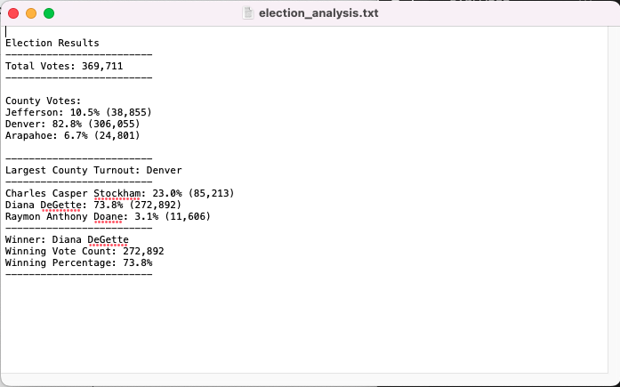

# Election-Analysis

## Project Overview
A Colorado Board of Elections employee has given you the following task to complete the election audit of a local congressional election.

1. Calculate the total number of votes cast.
2. Get a complete list of candidates who received votes.
3. Calculate the total number of votes each candidate received.
4. Calculate the percentage of votes each candidate won.
5. Determine the winner of the election based on popular vote.

Upon completing the initial election analysis, the election commision has requested additional data:
- The voter turnout for each county
- The percentage fo votes from each county out of the total count
- The county with the highest turnout.

## Summary
### Candidate Results
The analysis of the election show that:
- There were 369,711 votes cast.
- The candidates were:
    - Charles Casper Stockham
    - Diana DeGette
    - Raymon Anthony Doane
- The results were:
    - Charles Casper Stockham received 23.0% of the vote and 85,213 votes.
    - Diana DeGette received 73.8% of the vote and 272,892 votes.
    - Raymon Anthony Doane received 3.1% of the vote and 11,606 votes.
- The winner of the election was:
    - Candidate Diana DeGette, who recieved 73.8% of the vote and 272,892 votes.
  
### County Results
- The voter turnout for each county:
    - Arapahoe County: 24,801 votes
    - Denver County: 306,055 votes
    - Jefferson County: 38,855 votes
- The percentage of votes from each county out of the total count
    - Arapahoe County: 6.7%
    - Denver County: 82.8%
    - Jefferson County: 10.5%
- The county with the highest turnout was Denver, with 82.8% of the votes and 306,055 votes.

This script could be used for future elections in Colorado or other geographies. We could easily measure a much larger data set and look into granular voter turnout by city, voting precinct, district, or zip code. This code can easily scale for different elected positions, say county Sherrif, or any number of candidates by simply defining the appropriate variables, lists, or dictionaries.

## Resources
- Data Source: election_results.csv
- Software: Python 3.9.12, Visual Studio Code 1.68.0
